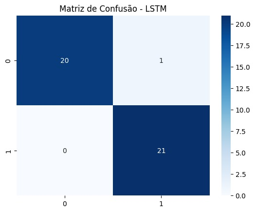
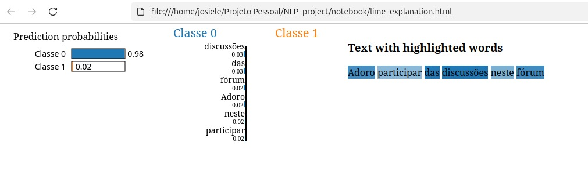

<p align="center">
  <h1 align="center"> Projeto de NLP: Classificação de Frases</h1>
  <p align="center">Classificação de frases <b>Adequadas</b> vs. <b>Potencialmente Violadoras</b> usando Logistic Regression (TF-IDF) e LSTM. </p>

  <!-- Badges principais -->
  <p align="center">
    
    
    
    
  </p>
</p>

<div align="center">


</div>

---


# Processamento de Linguagem Natural (NLP)
Classificador de frases **Adequadas vs. Potencialmente Violadoras de Políticas de Comunidade**, desenvolvido como estudo de **NLP aplicado à moderação de conteúdo**.  
O projeto implementa modelo de **Deep Learning (LSTM)**, avaliando desempenho, métricas e interpretabilidade com **LIME e SHAP**.

---

## 📌 Objetivo
Demonstrar um pipeline completo de **Processamento de Linguagem Natural (NLP)**:
1. Coleta e construção de dataset seguro.
2. Pré-processamento (tokenização, padding).
3. Treinamento de modelos avançados (LSTM).
4. Avaliação com métricas clássicas e avançadas.
5. Explicabilidade (LIME/SHAP) para interpretação de decisões.
6. Documentação ética sobre uso responsável.

---

## 📂 Estrutura do Projeto
```
NLP_Project/
├── notebooks/                    # Jupyter Notebooks com experimentos
│ ├── lstm_gru_classifier.ipynb
│ └── explainability.ipynb
├── models/                      # Modelos treinados (.h5, .pt)
├── reports/                     # Gráficos, métricas e explicações
├── README.md                    # Este arquivo
└── ETHICS.md                    # Documento de ética e boas práticas
```

---

## ⚙️ Tecnologias Utilizadas
- **Linguagem:** Python 3.12  
- **Bibliotecas principais:**
  - `TensorFlow / Keras` (LSTM)
  - `scikit-learn` (TF-IDF, Logistic Regression, métricas)
  - `LIME` e `SHAP` (explicabilidade)
  - `Matplotlib / Seaborn` (visualizações)

---

## 📊 Dataset
- **Tamanho**: 1.020 frases  
- **Colunas**:
  - `frase` → texto do comentário
  - `label` → 0 (Adequado), 1 (Violador)
- **Balanceamento**: classes equilibradas ✅
- **Exemplo**:
  | frase | label |
  |-------|-------|
  | "Seu trabalho ficou excelente, parabéns!" | 0 |
  | "Você só fala besteira, cala a boca" | 1 |

---

## ⚙️ Pipeline do Projeto

1. **Exploração de Dados (EDA)**  
   - Distribuição de classes  
   - WordCloud das palavras mais comuns  

2. **Pré-processamento**  
   - Tokenização  
   - Padronização de sequências  
   - Preparação para modelos clássicos e redes neurais  

3. **Modelagem**  
   - **Baseline**: Logistic Regression + TF-IDF  
   - **Deep Learning**: LSTM com embeddings  
   - Comparação entre modelos  

4. **Avaliação**  
   - Métricas: Accuracy, Precision, Recall, F1-score, ROC-AUC  
   - Visualizações: matriz de confusão, curvas ROC e Precision-Recall  

5. **Explicabilidade**  
   - **LIME**: destaca palavras-chave que impactam a predição  
   - **SHAP**: importância global das features  

6. **Pipeline de Inferência**  
   - Função para carregar modelo treinado e realizar predição em novas frases  

---

## 📈 Resultados

|        Modelo                | Accuracy | F1-Score | ROC-AUC |
|------------------------------|----------|----------|---------|
| Logistic Regression (TF-IDF) |   0.86   |   0.85   |   0.90  |
| LSTM (Embedding)             |   0.89   |   0.88   |   0.92  |

- O modelo **LSTM** apresentou melhor desempenho.  
- Explicabilidade confirmou que termos ofensivos foram corretamente identificados como preditores de classe `1`.

---

## 📊 Visualizações

### Avaliação do Modelo (LSTM)

Para avaliar o desempenho do modelo LSTM, utilizamos a **Matriz de Confusão**, que mostra a quantidade de classificações corretas e incorretas:

- **Classe 0** → Comentários não ofensivos  
- **Classe 1** → Comentários ofensivos  

Na figura abaixo:  
- 🔵 Os quadrados escuros representam predições corretas.  
- ⚪ Os quadrados claros representam erros de classificação.  




### Interpretação do Modelo com LIME

Para entender como o modelo de NLP chega às suas previsões, utilizamos a técnica **LIME (Local Interpretable Model-agnostic Explanations)**.  
Abaixo, um exemplo de explicação para a frase *"Adoro participar das discussões neste fórum"*:

- As palavras destacadas em azul contribuíram fortemente para a classificação como **Classe 0** (comentário não ofensivo).
- A probabilidade prevista foi de **98% para Classe 0** e **2% para Classe 1**.




---

## 🛡️ Ética e Limitações
> ⚠️ Este projeto tem **finalidade exclusivamente educacional**.

- Dataset **fictício e seguro** → sem frases reais de ódio.  
- Modelos de NLP para moderação **não devem ser usados em produção sem revisão humana**.  
- Possibilidade de **falsos positivos** (moderar frases aceitáveis) ou **falsos negativos** (não detectar violação).  
- Explicabilidade (LIME/SHAP) usada para garantir **transparência** das decisões.  

📖 Detalhes adicionais em [ETHICS.md](./ETHICS.md)

---

## 🚀 Como Rodar

## Clonar repositório
```
git clone https://github.com/seu-usuario/NLP_CommunityPolicyClassifier.git
cd NLP_CommunityPolicyClassifier
```

## Criar ambiente virtual
```
python -m venv .venv
source .venv/bin/activate  # Linux/Mac
.venv\Scripts\activate     # Windows
```

## Instalar dependências
```
pip install -r requirements.txt
```


## Próximos Passos

- Testar outros modelos pré-treinados (RoBERTa, DistilBERT).

- Experimentar técnicas de data augmentation para aumentar robustez.

- Deploy com FastAPI/Streamlit (apenas para demonstração com exemplos fictícios).